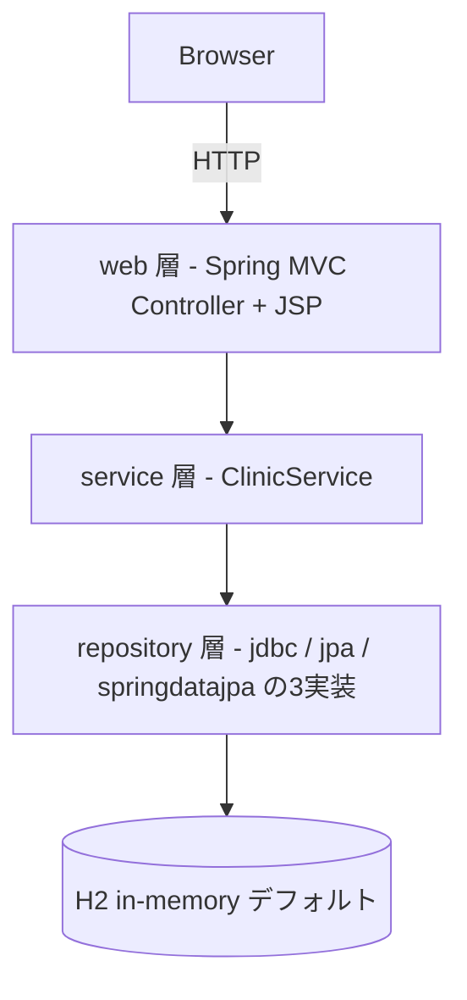

# CLAUDE.md — spring-framework-petclinic

レガシー Java アプリのモダナイゼーション練習用リポジトリ(axyojp fork)。
Spring Boot を使わない素の Spring Framework + JSP + XML 設定の 3 層 Web アプリ。

## 必要環境

| ツール | 要件 | 備考 |
|---|---|---|
| JDK | 17 以上 | pom.xml の `<java.version>17</java.version>` + enforcer で強制 |
| Maven | 3.8.4 以上 | enforcer の `requireMavenVersion`。**必ず Maven Wrapper (`./mvnw`) を使う**(wrapper は 3.8.4 を自動取得) |

ハマりどころ: システムに古い Maven(例: Ubuntu 22.04 の apt 版 3.6.3)が入っていると
`mvn` 直叩きは enforcer で即失敗する。常に `./mvnw` を使うこと。

## ビルド・テスト・起動

```bash
./mvnw clean package        # ビルド + 全テスト実行(war は target/petclinic.war)
./mvnw test                 # テストのみ(75 件、スキップ設定なし)
./mvnw jetty:run-war        # ローカル起動 → http://localhost:8080/
```

- 起動は jetty-maven-plugin(pom.xml に tomcat 系プラグインは無い)。起動完了まで 1〜2 分かかる。
- 初回ビルドは依存ダウンロードで数分かかる。
- SCSS を変更した場合のみ `./mvnw generate-resources -P css` で CSS を再生成する。

## DB プロファイル

デフォルトは **H2 インメモリ**(`activeByDefault` の Maven プロファイル。起動時に
`src/main/resources/db/h2/` のスクリプトでデータ投入)。他に HSQLDB / MySQL / PostgreSQL
プロファイルがある(例: `./mvnw jetty:run-war -P MySQL`。要・外部 DB 起動)。

永続層は Spring プロファイルで切替: `jpa`(デフォルト)/ `jdbc` / `spring-data-jpa`
(`-Dspring.profiles.active=jdbc`)。

## プロジェクト構成



- Java: `src/main/java/org/springframework/samples/petclinic/` 配下に
  `model` / `repository`(jdbc・jpa・springdatajpa の 3 実装)/ `service` / `web` / `util`
- ブートストラップ: `web.xml` は無く、`PetclinicInitializer.java`(WebApplicationInitializer)が起点
- **Spring 設定 XML は `src/main/resources/spring/` に集約**
  (`mvc-core-config.xml`, `mvc-view-config.xml`, `business-config.xml`, `datasource-config.xml`, `tools-config.xml`)。
  `WEB-INF` 配下には置かない方針(`WEB-INF/no-spring-config-files-there.txt` 参照)
- JSP: `src/main/webapp/WEB-INF/jsp/`、カスタムタグ: `src/main/webapp/WEB-INF/tags/`
- DB スクリプト: `src/main/resources/db/{h2,hsqldb,mysql,postgresql}/`
- テスト: `src/test/java/`(model / service / web の 14 クラス・75 テスト)

## 開発フロー

- upstream: `spring-petclinic/spring-framework-petclinic`(remote 登録済み)。
  追従は `git fetch upstream && git merge upstream/main`
- main へ直接コミットせず、ブランチ + PR で作業する
